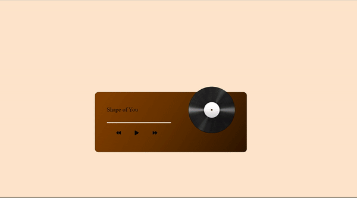

<h1>Music Player</h1>

This is a simple music player built with javascript.

The main objective of this project is to get into the Javascript programming language, learn to manage the DOM and its attributes.

<h3>Project Specifications:</h3>
<ul>
  <li>Add play and pause functionality</li>
  <li>Switch songs</li>
  <li>Progress bar</li>
</ul>
